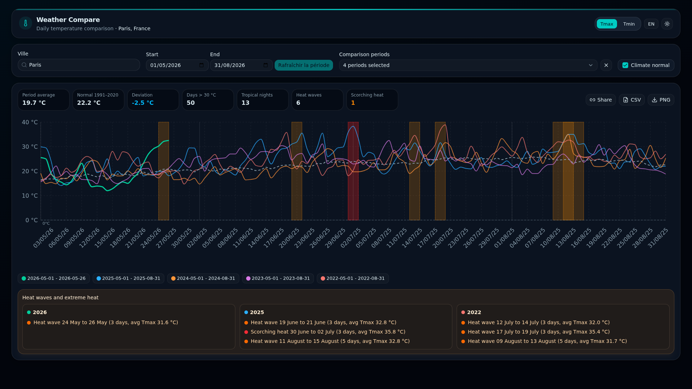

<h2 align="center"><b>Weather Comparator</b></h2>
<h4 align="center">Historical weather comparison dashboard - city search, multi-year charts, climate normals, extreme events, and exports.</h4>

<p align="center">
<a href="https://nextjs.org/"></a>
<a href="https://react.dev/"></a>
<a href="https://www.typescriptlang.org/"></a>
<a href="https://tailwindcss.com/"></a>
<a href="https://open-meteo.com/"></a>
</p>

<hr>
<p align="center">
<a href="#screenshots">Screenshots</a> &bull;
<a href="#features">Features</a> &bull;
<a href="#stack">Stack</a> &bull;
<a href="#quick-start">Quick Start</a> &bull;
<a href="#configuration">Configuration</a> &bull;
<a href="#project-structure">Project Structure</a>
</p>
<hr>

One-page weather analytics app for comparing daily temperatures across years. Search for a city, choose a month and reference year, compare the current year with past years, inspect heatwave and cold-wave periods, surface climate normals, review extreme event years in the chart tooltip, and export the chart or source data.

## Screenshots

<p align="center">
  
</p>

## Features

- **City search** - autocomplete powered by the Open-Meteo Geocoding API
- **Multi-year comparison** - reference year plus selectable historical years
- **Temperature modes** - switch between daily maximum and minimum temperatures
- **Interactive chart** - Recharts line chart with year visibility toggles
- **Climate normals** - optional 1991-2020 seasonal baseline overlay
- **Heatwave detection** - automatic highlight of hot periods in visible datasets
- **Cold-wave overlays** - highlight cold periods across the compared datasets
- **Extreme event tooltips** - show the years and labels of notable heat and cold events directly in the chart tooltip
- **Tooltip sorting** - values are ordered from hottest to coldest for easier reading
- **Climate summary** - monthly averages, anomalies, hot days, and tropical nights
- **Exports** - PNG chart export and CSV data export
- **Persistent city** - selected city stored locally for the next visit
- **Bilingual UI** - full French and English coverage across the interface
- **Accessible chart interactions** - keyboard-friendly chart behavior with cleaned-up focus handling
- **Responsive UI** - desktop and mobile layout with light/dark theme support

## Stack

| Layer      | Technology                                           |
| ---------- | ---------------------------------------------------- |
| Framework  | Next.js 16.2 (App Router)                            |
| Language   | TypeScript 5.9                                       |
| UI         | React 19.2, Tailwind CSS 4.3, shadcn/ui, Radix UI    |
| Charts     | Recharts 3.8                                         |
| Data       | TanStack Query 5, Open-Meteo APIs                    |
| State      | Zustand 5, localStorage persistence                  |
| Export     | html-to-image, PapaParse                             |
| Tooling    | pnpm 10, ESLint 9, Prettier 3                        |

## Quick Start

```bash
pnpm install
pnpm dev
```

App runs at `http://localhost:3000`.

## Configuration

No API key is required. Weather Compare uses public Open-Meteo endpoints:

| API | Purpose |
| --- | ------- |
| `https://geocoding-api.open-meteo.com/v1/search` | City autocomplete |
| `https://archive-api.open-meteo.com/v1/archive` | Historical daily temperatures |
| Historical archive data for 1991-2020 | Computed seasonal normals |

## Project Structure

```text
src/
├── app/                    # Next.js route shell, layout, providers
├── components/ui/          # Reusable UI primitives
├── features/weather/
│   ├── api/                # Weather and geocoding data access
│   ├── components/         # Dashboard, chart, controls, summary, export, extremes
│   ├── hooks/              # Queries, URL sync, browser behavior
│   ├── logic/              # Date handling, normalization, climate normals, extremes, exports
│   ├── store/              # Zustand UI state only
│   └── types/              # Weather domain types
└── lib/                    # App-wide utilities such as i18n and theme
```

The main route in `src/app/page.tsx` renders `WeatherDashboard` from
`src/features/weather/components/dashboard`.

## Scripts

| Command             | Description                    |
| ------------------- | ------------------------------ |
| `pnpm dev`          | Start the development server   |
| `pnpm build`        | Build for production           |
| `pnpm start`        | Serve the production build     |
| `pnpm lint`         | Run ESLint                     |
| `pnpm test`         | Run the automated tests        |
| `pnpm typecheck`    | Type-check with TypeScript     |

## Tests

Run the test suite locally with:

```bash
pnpm test
```

Before opening a pull request, run the same checks as CI:

```bash
pnpm lint
pnpm typecheck
pnpm test
pnpm build
```

## Data Sources

- [Open-Meteo](https://open-meteo.com/)
- [Open-Meteo Historical Weather API](https://open-meteo.com/en/docs/historical-weather-api)

## License

MIT
